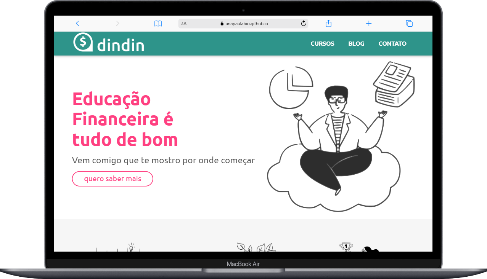
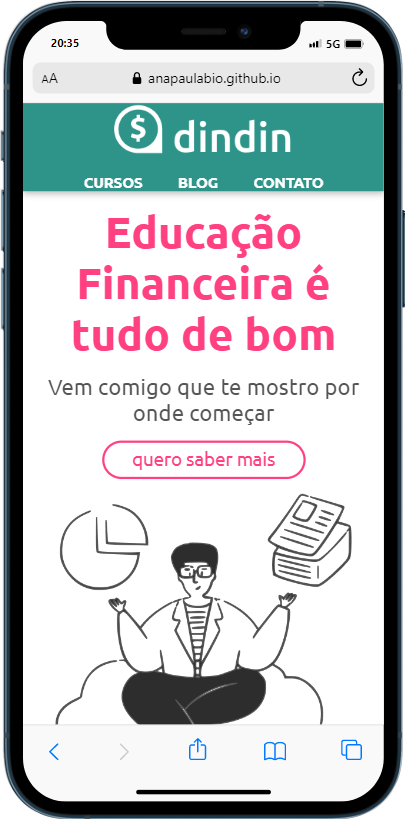
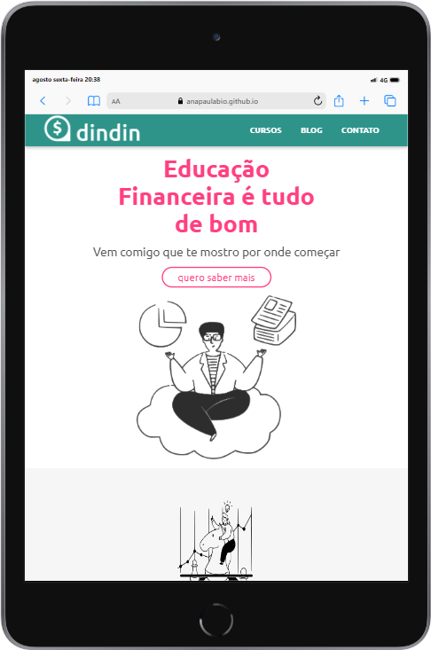

<

  <h2 align="center">Desafio Hacker - Hands On  </h2>

## 📕 Indice

* [📋 Enunciado](#📋-Sobre)
* [🖥 Tecnologias](#🖥-Tecnologias)
* [📝 Licença](#📝-Licença)

## 📋 Enunciado

   A empresa fictícia DINDIN, queria lançar uma plataforma de conteúdo sobre Educação Financeira.
Foi desenvolvido um site estático com design responsivo para tablet e mobile. 

 

## 🖥 Tecnologias

- <a href="https://www.w3schools.com/html/">HTML</a>

- <a href="https://www.w3schools.com/css/default.asp">CSS</a>

## 📝 Licença

Este projeto esta sobe a licença [MIT](./LICENSE).

Feito por Ana Paula Oliveira 👋🏻 [Entre em contato!](https://www.linkedin.com/in/anapaulaoliveiraa/)
